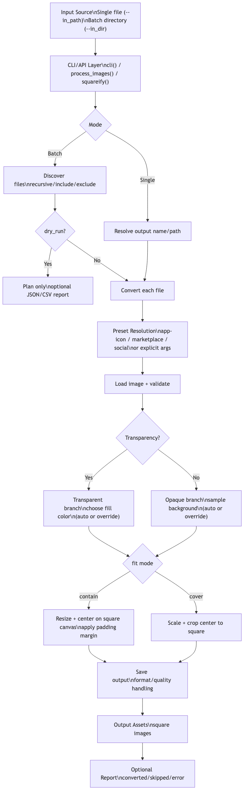

==============
logo_to_square
==============

Convert logos/images to square outputs with smart background fill.
turn any logo/image into production-ready square assets in one command or API call.

Project Brief
=============

``logo_to_square`` is a lightweight Python tool that converts logos and other images into
clean square assets for consistent use across apps, marketplaces, and social profiles.
It supports multiple input/output formats, smart background handling, composition controls
(``contain``/``cover`` + padding), presets, and batch processing with optional reports.

Architecture Diagram
====================

Source Mermaid file:
``docs/architecture.mmd``

You can view/edit it in Mermaid Live:
https://mermaid.live/

Before/After Showcase
=====================

Input example:

Square output:

Install
=======

.. code-block:: bash

    pip install -e .

CLI Usage
=========

Single image:

.. code-block:: bash

    logo-to-square \
      --in_path /path/to/logo.png \
      --out_path /path/to/output \
      --out_file_name logo \
      --target_size 400

Batch directory:

.. code-block:: bash

    logo-to-square \
      --in_dir /path/to/input-dir \
      --out_path /path/to/output-dir \
      --target_size 400 \
      --format webp \
      --recursive \
      --include "brand/*.png" \
      --dry_run \
      --report_path /path/to/report.json \
      --overwrite

Preset quick start:

.. code-block:: bash

    logo-to-square \
      --in_path /path/to/logo.png \
      --out_path /path/to/output \
      --preset app-icon

Useful options:

- ``--preset``: ``app-icon``, ``marketplace``, ``social`` (bundled settings)
- ``--format``: ``webp`` (default), ``png``, ``jpeg``, ``bmp``, ``tiff``, ``gif``, ``ico``
- ``--quality``: integer from 1 to 100 (default: 95)
- ``--background``: ``auto``, ``black``, ``white``, or ``#RRGGBB``
- ``--fit``: ``contain`` (default) or ``cover``
- ``--padding``: safe margin ratio, e.g. ``0.08``
- ``--no_upscale``: keep small source logos at native resolution to avoid blur
- ``--dry_run`` and ``--report_path report.json|report.csv`` for batch previews/reports

Preset defaults:

- ``app-icon``: 512px, PNG, quality 100, contain, padding 0.10
- ``marketplace``: 1024px, WebP, quality 92, contain, padding 0.06
- ``social``: 1200px, JPEG, quality 90, cover, padding 0.00

Python API
==========

.. code-block:: python

    from logo_to_square.square_img_using_PIL import squareify

    output = squareify(
        img_path="logo.png",
        target_size=400,
        out_path="out",
        filename="logo",
        output_format="webp",
        quality=95,
        background="auto",
        fit="contain",
        padding=0.05,
        preset=None,
    )
    print(output)  # out/logo_square.webp

Batch API:

.. code-block:: python

    from logo_to_square.square_img_using_PIL import process_images

    process_images(
        in_img_path=None,
        in_dir="assets",
        target_size=400,
        out_img_path="out",
        filename=None,
        output_format="webp",
        quality=90,
        background="auto",
        overwrite=False,
        recursive=True,
        include=["**/*.png"],
        exclude=["**/drafts/*"],
        dry_run=False,
        report_path="out/report.csv",
    )

Notes
=====

- ``contain`` keeps the full logo visible (recommended for most brand assets).
- ``cover`` fills the square completely and may crop edges.
- When ``background=auto``, transparent inputs use dominant-color contrast and opaque
  inputs infer background from near-corner pixels.
- In batch mode, use ``--dry_run`` first to verify file selection and output paths.
- Reports include per-file status (converted/skipped/error) to make runs auditable.

Known Limitations
=================

- Subject-aware centering is not implemented yet; centering is geometric.
- Animated formats (for example animated GIFs/WebP) are processed as single-frame outputs.
- The auto-background heuristic may need manual override for edge-case logos (use
  ``--background`` when needed).
